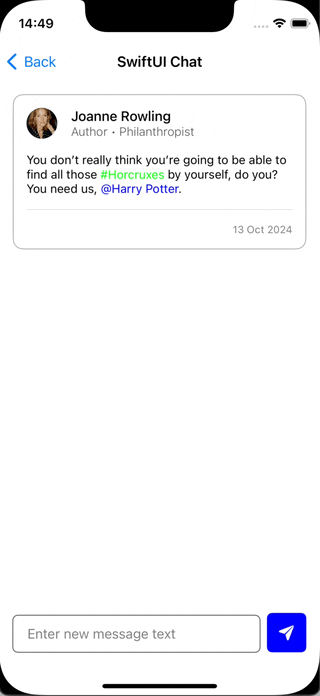

# TagTextView

This is a continuation of the project **DPTagTextView**  created by [Datt1994 (Datt Patel) · GitHub](https://github.com/Datt1994) . SwiftUI wrapper was taken from [GitHub - SwiftUI-Plus/TextView: Provides a SwiftUI multi-line TextView implementation including support for auto-sizing. (iOS)](https://github.com/SwiftUI-Plus/TextView) repository created by [shaps80 (Shaps) · GitHub](https://github.com/shaps80).


## Example

To run the example project, clone the repo, and run `pod install` from the TagTextViewExample directory first.


## Story

I was not able to find Tag TextView with need for my project functionality and SwiftUI support. So to speed up the development process, I had taken **DPTagTextView** and update it. Please feel free to report any issue you will face with.

## Installation

#### CocoaPods

LogsManager is available through [CocoaPods](http://cocoapods.org). To install
it, simply add the following line to your Podfile:

For the main app target:

```ruby
pod 'TagTextView', '~> 1.0.0'
```

## Usage

You have to add logs component first if you want your logs to be separated by components:

```swift
TagTextView(
    $viewModel.inputText,
    tags: $viewModel.selectedTagsList,
    onDidBeginEditing: {
        viewModel.inputState = .selected
    },
    onDidEndEditing: {
        viewModel.inputState = .base
    },
    didChangedTagSearchString: { searchString, isHashTag in
        if !isHashTag {
            viewModel.searchTags(by: searchString)
        } else {
            viewModel.searchTags(by: nil)
        }
    }
)
.placeholder(viewModel.placeholder ?? .empty) {
    $0.foregroundColor(Color(viewModel.inputState.textFieldStyle.placeholder.textColor))
}
.foregroundColor(viewModel.inputState.textFieldStyle.text.textColor)
.font(Constants.inputTextFont)
.mentionColor(Constants.mentionColor)
.mentionFont(Constants.inputTextFont)
.hashTagColor(Constants.hashTagColor)
.hashTagFont(Constants.inputTextFont)
.scrollingBehavior(.maxHeight(100))
.padding(.vertical, 4)
.padding(.horizontal, 12)
.background {
    RoundedRectangle(cornerRadius: viewModel.inputState.cornerRadius)
        .stroke(Color(viewModel.inputState.borderColor), lineWidth: viewModel.inputState.borderWidth)
}
.padding(.vertical, 0)
```

See example and test projects for more details.


## Still not ready

- Swift Package manager support

- UIKit Example

## Contributions

Any contribution is more than welcome! You can contribute through pull requests and issues on GitHub.

## Author

Igor Kharytaniuk, kharytaniuk@gmail.com

## License

TagTextView is available under the MIT license. See the LICENSE file for more info.
